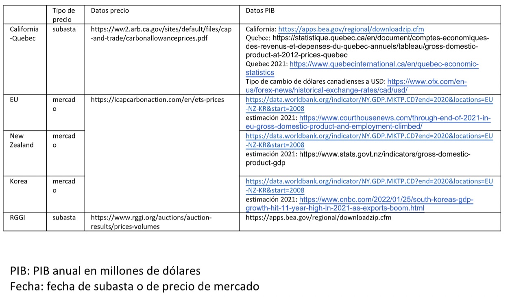

```{r include=FALSE}
rm(list=ls()) # borrar todo en la memoria
options(digits = 10) # decimales
options(scipen = 100) # para evitar notacion scientifica qUE afectaba la leyenda de la grafica
knitr::opts_chunk$set(echo = FALSE) # Para qUE predeterminadamente no salga el output de los codigos.
```


```{r include=FALSE}
#######################
####  Directorio  #####
#######################
#### (Cambiar solo despUEs del "~/ a donde este guardado la carpeta) 
knitr::opts_knit$set(root.dir = "~/Desktop/Precios del carbono")  # Directorio

######################

knitr::opts_chunk$set(out.width = '100%', dpi=300) # Resolucion y tamanio de figuras
knitr::opts_chunk$set(fig.env="figure") # Latex figure environment

# tinytex::install_tinytex() # Por si no está instalado o acualizado correr esta linea.
```


```{r include=FALSE}
# Para instalar paqUEtes qUE no esten descargados qUE sean necesarios
lista.de.paqUEte1 <- c("tidyverse","stargazer", "lubridate", "patchwork")
nUEvo.paqUEte1 <- lista.de.paqUEte1[!(lista.de.paqUEte1 %in% 
                                             installed.packages()[,"Package"])]
if(length(nUEvo.paqUEte1)) install.packages(nUEvo.paqUEte1, dependencies = TRUE, force = TRUE)


library(dplyr)
library(ggplot2)


P_c <- read.csv("DatosPIBPrecio.csv")
nrow(P_c)
P_c <- P_c[1:169,]
head(P_c)
tail(P_c)
summary(P_c)
str(P_c)


P_c$Fecha = as.Date(P_c$Fecha, format = "%Y-%m-%d") # convert date, to date format
P_c$Anio <- as.factor(P_c$Anio)
P_c$California_Quebec <- gsub("\\$","", P_c$California_Quebec)
P_c$California_Quebec <- as.numeric(P_c$California_Quebec)

str(P_c)
typeof(P_c$Fecha)
typeof(P_c$Anio)


str(P_c)


P_c$Anio = as.Date(P_c$Anio, format = "%Y")


UEG <- ggplot(P_c) + geom_line(aes(x = Fecha, y = UE, color = "Precio"), na.rm =T) + geom_line(aes(x = Anio, y = ((PIB_UE - 12500000)/16000-50)/2 , color = "PIB"), na.rm = T) + scale_y_continuous(
       
       # Primer Eje
       name = "Precio (USD/tCO2e)",
       
       # Segundo Eje
       sec.axis = sec_axis(~.*125000/4 + 13400000 , name="PIB (millones de dólares)", breaks = c(13500000, 14000000, 14500000, 15000000, 15500000, 16000000)))


UEG <- UEG + scale_color_manual(name = "Indicador", values = c(PIB = "Red", Precio = "BlUE"))

#install.packages("ggnewscale")
library(ggnewscale)


# WHO declara pandemia:
UEG <- UEG + new_scale_color() +
       geom_vline(aes(xintercept = as.numeric(as.Date("2020-03-11")), color = "WHOPandemia"))


# Crisis financiera 2008
UEG <- UEG +
       geom_vline(aes(xintercept = as.numeric(as.Date("2008-01-01")), color = "Crisis2008"))


# Protocolo de Kyoto entró en vigor
UEG <- UEG +
       geom_vline(aes(xintercept = as.numeric(as.Date("2015-02-16")), color = "PKyotoVigor"))

# Fecha de firma acUErdo de Paris
UEG <- UEG +
       geom_vline(aes(xintercept = as.numeric(as.Date("2016-12-04")), color = "TParisVigor"))

# Invacion Rusia
UEG <- UEG +
       geom_vline(aes(xintercept = as.numeric(as.Date("2022-02-24")), color = "RusiaUcrania"))

# UE propone reducir a 55%
UEG <- UEG +
       geom_vline(aes(xintercept = as.numeric(as.Date("2022-04-05")), color = "PropuestaUE55"))

# Agregamos una leyenda para las fechas importantes:

UEG <- UEG +
       scale_color_manual(name = "Fechas Importantes", values =
                                    c(WHOPandemia = "Green",
                                      PKyotoVigor = "Orange",
                                      TParisVigor = "Black",
                                      Crisis2008 = "DarkBlue",
                                      RusiaUcrania = "Gray",
                                      PropuestaUE55 = "Red"))


UEG <- UEG +
       xlab("Año") + # nombre de eje x
       ylab("Precio (USD/tCO2e)") + # nombre de eje y
       labs(caption = "Elaborado por WRI México con datos de ICAP, Banco Mundial y Corthouse news") +
       ggtitle("Precios del carbono y PIB UE") + # titulo de grafica
       theme(axis.title.x = element_text(color="Black", size=8), # tamanio y color de titulo del eje x
             axis.title.y = element_text(color = " Black", size=8), # tamanio y color del titulo del eje y
             
             axis.text.x = element_text(size=8), # tamanio y color de los numeros del eje x
             axis.text.y = element_text(size=8),# tamanio y color de los numeros del eje y
             legend.key.height = unit(0.5, "cm"),
             legend.title = element_text(size=8), # tamanio del titulo del indice
             legend.text = element_text(size=6), # tamanio del texto del indice
             legend.position = "right",
             legend.justification = c(1,1), # posicion de inidice
             
             plot.title = element_text(color="DarkBlUE", # color del titulo de grafica
                                       size=15, # tamanio del titulo de grafica
                                       family="Courier"))  # tipo de letra del titulo de grafica 


UEG <- UEG + theme_minimal()


ggplot(P_c) + geom_line(aes(x = Fecha, y = PIB_Corea , color = "PIB"))


CoreaG <- ggplot(P_c) + geom_line(aes(x = Fecha, y = Corea, color = "Precio"), na.rm = T) + geom_line(aes(x = Anio, y = (PIB_Corea/100000)*2.5 - 12.5 , color = "PIB"), na.rm = T) + scale_y_continuous(
       
       # Primer Eje
       name = "Precio (USD/tCO2e)",
       
       # Segundo Eje
       sec.axis = sec_axis(~.*80000/2 + 500000, name="PIB (millones de dólares)", breaks = c(1000000, 1200000, 1400000, 1600000))
)


CoreaG <- CoreaG + scale_color_manual(name = "Indicador", values = c(PIB = "Red", Precio = "Blue"))


# WHO declara pandemia:
CoreaG <- CoreaG + new_scale_color() +
       geom_vline(aes(xintercept = as.numeric(as.Date("2020-03-11")), color = "WHOPandemia"))


# Crisis financiera 2008
CoreaG <- CoreaG +
       geom_vline(aes(xintercept = as.numeric(as.Date("2008-01-01")), color = "Crisis2008"))


# Protocolo de Kyoto entró en vigor
CoreaG <- CoreaG +
       geom_vline(aes(xintercept = as.numeric(as.Date("2015-02-16")), color = "PKyotoVigor"))

# Fecha de firma acCoreardo de Paris
CoreaG <- CoreaG +
       geom_vline(aes(xintercept = as.numeric(as.Date("2016-12-04")), color = "TParisVigor"))

# Invacion Rusia
CoreaG <- CoreaG +
       geom_vline(aes(xintercept = as.numeric(as.Date("2022-02-24")), color = "RusiaUcrania"))

# Agregamos una leyenda para las fechas importantes:

CoreaG <- CoreaG +
       scale_color_manual(name = "Fechas Importantes", values =
                                    c(WHOPandemia = "Green",
                                      PKyotoVigor = "Orange",
                                      TParisVigor = "Black",
                                      Crisis2008 = "DarkBlue",
                                      RusiaUcrania = "Gray"))


CoreaG <- CoreaG +
       xlab("Año") + # nombre de eje x
       ylab("Precio (USD/tCO2e)") + # nombre de eje y
       labs(caption = "Elaborado por WRI México con datos de ICAP, Banco Mundial y CNBC") +
       ggtitle("Precios del carbono y PIB Corea") + # titulo de grafica
       theme(axis.title.x = element_text(color="Black", size=8), # tamanio y color de titulo del eje x
             axis.title.y = element_text(color = " Black", size=8), # tamanio y color del titulo del eje y
             
             axis.text.x = element_text(size=8), # tamanio y color de los numeros del eje x
             axis.text.y = element_text(size=8),# tamanio y color de los numeros del eje y
             legend.key.height = unit(0.5, "cm"),
             legend.title = element_text(size=8), # tamanio del titulo del indice
             legend.text = element_text(size=6), # tamanio del texto del indice
             legend.position = "right",
             legend.justification = c(1,1), # posicion de inidice
             
             plot.title = element_text(color="DarkBlue", # color del titulo de grafica
                                       size=15, # tamanio del titulo de grafica
                                       family="Courier"))  # tipo de letra del titulo de grafica 


CoreaG <- CoreaG + theme_minimal()


CoreaG


P_c2 <- P_c[complete.cases(P_c$California_Quebec),]
ggplot(P_c2) + geom_line(aes_(x = P_c2$Fecha, y = P_c2$California_Quebec, group = 1), na.rm = T)


ggplot(P_c) + geom_line(aes(x = Fecha, y = PIB_CaliforniaQuebec, color = "PIB"), na.rm = T)


CALQUEG <- ggplot(P_c) + geom_line(data = P_c2, aes_(x = P_c2$Fecha, y = P_c2$California_Quebec, group = 1, color = "Precio"), na.rm = T) + geom_line(aes(x = Anio, y = (PIB_CaliforniaQuebec/400000) - 5, color = "PIB"), na.rm = T) + scale_y_continuous(
       
       # Primer Eje
       name = "Precio (USD/tCO2e)",
       
       # Segundo Eje
       sec.axis = sec_axis(~.*400000 + 2000000, name="PIB (millones de dólares)", breaks = c(9000000, 10000000, 11000000))
)


CALQUEG <- CALQUEG + scale_color_manual(name = "Indicador", values = c(PIB = "Red", Precio = "Blue"))

# Crisis financiera 2008
CALQUEG <- CALQUEG +
       geom_vline(aes(xintercept = as.numeric(as.Date("2008-01-01")), color = "Crisis2008"))

# WHO declara pandemia:
CALQUEG <- CALQUEG + new_scale_color() +
       geom_vline(aes(xintercept = as.numeric(as.Date("2020-03-11")), color = "WHOPandemia"))


# Protocolo de Kyoto entró en vigor
CALQUEG <- CALQUEG +
       geom_vline(aes(xintercept = as.numeric(as.Date("2015-02-16")), color = "PKyotoVigor"))

# Fecha de firma acCoreardo de Paris
CALQUEG <- CALQUEG +
       geom_vline(aes(xintercept = as.numeric(as.Date("2016-12-04")), color = "TParisVigor"))

# Invacion Rusia
CALQUEG <- CALQUEG +
       geom_vline(aes(xintercept = as.numeric(as.Date("2022-02-24")), color = "RusiaUcrania"))

# Agregamos una leyenda para las fechas importantes:

CALQUEG <- CALQUEG +
       scale_color_manual(name = "Fechas Importantes", values =
                                    c(WHOPandemia = "Green",
                                      PKyotoVigor = "Orange",
                                      TParisVigor = "Black",
                                      Crisis2008 = "DarkBlue",
                                      RusiaUcrania = "Gray"))


CALQUEG <- CALQUEG +
       xlab("Año") + # nombre de eje x
       ylab("Precio (USD/tCO2e)") + # nombre de eje y
       labs(caption = "CARB, bea, Quebec International y Institut de la statistique du Québec") +
       ggtitle("Precios del carbono y PIB California-Quebec") + # titulo de grafica
       theme(axis.title.x = element_text(color="Black", size=8), # tamanio y color de titulo del eje x
             axis.title.y = element_text(color = " Black", size=8), # tamanio y color del titulo del eje y
             
             axis.text.x = element_text(size=8), # tamanio y color de los numeros del eje x
             axis.text.y = element_text(size=8),# tamanio y color de los numeros del eje y
             legend.key.height = unit(0.5, "cm"),
             legend.title = element_text(size=8), # tamanio del titulo del indice
             legend.text = element_text(size=6), # tamanio del texto del indice
             legend.position = "right",
             legend.justification = c(1,1), # posicion de inidice
             
             plot.title = element_text(color="DarkBlue", # color del titulo de grafica
                                       size=15, # tamanio del titulo de grafica
                                       family="Courier"))  # tipo de letra del titulo de grafica 


CALQUEG <- CALQUEG + theme_minimal()


CALQUEG


P_c3 <- P_c[complete.cases(P_c$RGGI),]
ggplot(P_c3) + geom_line(aes_(x = P_c3$Fecha, y = P_c3$RGGI, group = 1), na.rm = T)


ggplot(P_c) + geom_line(aes(x = Fecha, y = PIB_RGGI, color = "PIB"), na.rm = T)


RGGIGG <- ggplot(P_c) + geom_line(data = P_c3, aes_(x = P_c3$Fecha, y = P_c3$RGGI, group = 1, color = "Precio"), na.rm = T) + geom_line(aes(x = Anio, y = (PIB_RGGI/2000000)*2 - 7, color = "PIB"), na.rm = T) + scale_y_continuous(
       
       # Primer Eje
       name = "Precio (USD/tCO2e)",
       
       # Segundo Eje
       sec.axis = sec_axis(~.*2000000/2 + 7000000, name="PIB (millones de dólares)", breaks = c(14000000, 16000000, 18000000))
)


RGGIGG <- RGGIGG + scale_color_manual(name = "Indicador", values = c(PIB = "Red", Precio = "Blue"))


# WHO declara pandemia:
RGGIGG <- RGGIGG + new_scale_color() +
       geom_vline(aes(xintercept = as.numeric(as.Date("2020-03-11")), color = "WHOPandemia"))


# Crisis financiera 2008
RGGIGG <- RGGIGG +
       geom_vline(aes(xintercept = as.numeric(as.Date("2008-01-01")), color = "Crisis2008"))

# Protocolo de Kyoto entró en vigor
RGGIGG <- RGGIGG +
       geom_vline(aes(xintercept = as.numeric(as.Date("2015-02-16")), color = "PKyotoVigor"))

# Fecha de firma acCoreardo de Paris
RGGIGG <- RGGIGG +
       geom_vline(aes(xintercept = as.numeric(as.Date("2016-12-04")), color = "TParisVigor"))

# Invacion Rusia
RGGIGG <- RGGIGG +
       geom_vline(aes(xintercept = as.numeric(as.Date("2022-02-24")), color = "RusiaUcrania"))

# Agregamos una leyenda para las fechas importantes:

RGGIGG <- RGGIGG +
       scale_color_manual(name = "Fechas Importantes", values =
                                    c(WHOPandemia = "Green",
                                      PKyotoVigor = "Orange",
                                      TParisVigor = "Black",
                                      Crisis2008 = "DarkBlue",
                                      RusiaUcrania = "Gray"))


RGGIGG <- RGGIGG +
       xlab("Año") + # nombre de eje x
       ylab("Precio (USD/tCO2e)") + # nombre de eje y
       labs(caption = "Elaborado por WRI México con datos de bea y rggi.org") +
       ggtitle("Precios del carbono y PIB RGGI") + # titulo de grafica
       theme(axis.title.x = element_text(color="Black", size=8), # tamanio y color de titulo del eje x
             axis.title.y = element_text(color = " Black", size=8), # tamanio y color del titulo del eje y
             
             axis.text.x = element_text(size=8), # tamanio y color de los numeros del eje x
             axis.text.y = element_text(size=8),# tamanio y color de los numeros del eje y
             legend.key.height = unit(0.5, "cm"),
             legend.title = element_text(size=8), # tamanio del titulo del indice
             legend.text = element_text(size=6), # tamanio del texto del indice
             legend.position = "right",
             legend.justification = c(1,1), # posicion de inidice
             
             plot.title = element_text(color="DarkBlue", # color del titulo de grafica
                                       size=15, # tamanio del titulo de grafica
                                       family="Courier"))  # tipo de letra del titulo de grafica 


RGGIGG <- RGGIGG + theme_minimal()


RGGIGG


ggplot(P_c) + geom_line(aes(x = Fecha, y = NuevaZelanda, color = "Precio"))


ggplot(P_c) + geom_line(aes(x = Fecha, y = PIB_NuevaZelanda, color = "PIB"))


NZG <- ggplot(P_c) + geom_line(aes(x = Fecha, y = NuevaZelanda, color = "Precio"), na.rm = T) + geom_line(aes(x = Anio, y = (PIB_NuevaZelanda/3750)*2 - 60, color = "PIB"), na.rm = T) + scale_y_continuous(
       
       # Primer Eje
       name = "Precio (USD/tCO2e)",
       
       # Segundo Eje
       sec.axis = sec_axis(~.*3750/2 + 113000, name="PIB (millones de dólares)", breaks = c(125000, 150000, 175000, 200000, 225000))
)


NZG <- NZG + scale_color_manual(name = "Indicador", values = c(PIB = "Red", Precio = "BlUE"))


# WHO declara pandemia:
NZG <- NZG + new_scale_color() +
       geom_vline(aes(xintercept = as.numeric(as.Date("2020-03-11")), color = "WHOPandemia"))


# Crisis financiera 2008
NZG <- NZG +
       geom_vline(aes(xintercept = as.numeric(as.Date("2008-01-01")), color = "Crisis2008"))


# Protocolo de Kyoto entró en vigor
NZG <- NZG +
       geom_vline(aes(xintercept = as.numeric(as.Date("2015-02-16")), color = "PKyotoVigor"))

# Fecha de firma acUErdo de Paris
NZG <- NZG +
       geom_vline(aes(xintercept = as.numeric(as.Date("2016-12-04")), color = "TParisVigor"))

# Invacion Rusia
NZG <- NZG +
       geom_vline(aes(xintercept = as.numeric(as.Date("2022-02-24")), color = "RusiaUcrania"))

# Agregamos una leyenda para las fechas importantes:

NZG <- NZG +
       scale_color_manual(name = "Fechas Importantes", values =
                                    c(WHOPandemia = "Green",
                                      PKyotoVigor = "Orange",
                                      TParisVigor = "Black",
                                      Crisis2008 = "DarkBlue",
                                      RusiaUcrania = "Gray"))

NZG <- NZG + theme_minimal()

NZG <- NZG +
       xlab("Año") + # nombre de eje x
       ylab("Precio (USD/tCO2e)") + # nombre de eje y
       labs(caption = "Elaborado por WRI México con datos de ICAP y Banco Mundial") +
       ggtitle("Precios del carbono y PIB Nueva Zelanda") + # titulo de grafica
       theme(axis.title.x = element_text(color="Black", size=8), # tamanio y color de titulo del eje x
             axis.title.y = element_text(color = " Black", size=8), # tamanio y color del titulo del eje y
             
             axis.text.x = element_text(size=8), # tamanio y color de los numeros del eje x
             axis.text.y = element_text(size=8),# tamanio y color de los numeros del eje y
             legend.key.height = unit(0.5, "cm"),
             legend.title = element_text(size=8), # tamanio del titulo del indice
             legend.text = element_text(size=6), # tamanio del texto del indice
             legend.position = "right",
             legend.justification = c(1,1), # posicion de inidice
             
             plot.title = element_text(color="DarkBlUE", # color del titulo de grafica
                                       size=15, # tamanio del titulo de grafica
                                       family="Courier"))  # tipo de letra del titulo de grafica 


NZG


```


*** 


```{r echo=FALSE}
UEG
```

***

```{r echo=FALSE}
CoreaG
```


***

```{r}
CALQUEG
```

***

```{r}
RGGIGG
```

***

```{r}
NZG
```

***

## bibliografía



